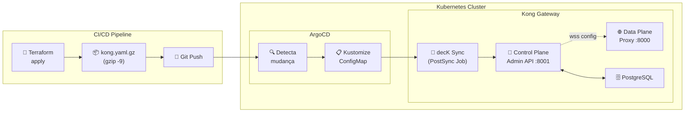
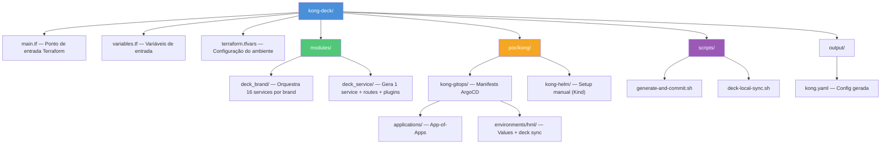
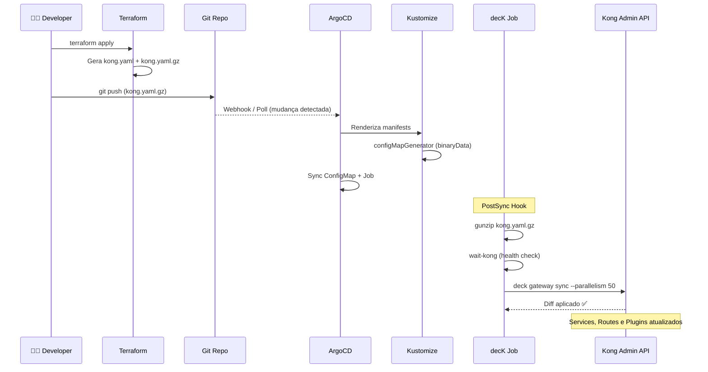
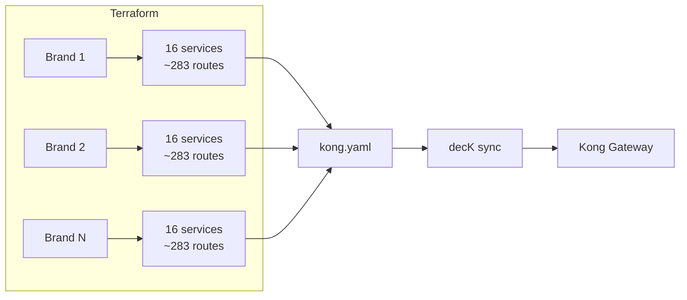

# Kong Deck — Configuração Declarativa do Kong Gateway

Gera a configuração declarativa do Kong Gateway (`kong.yaml`) usando Terraform e aplica via [decK](https://docs.konghq.com/deck/latest/) com deploy automático pelo ArgoCD.

## Arquitetura



## Como Funciona

| Etapa | O que acontece |
|-------|---------------|
| 1. `terraform apply` | Gera `output/kong.yaml` com todos os services, routes e plugins |
| 2. `gzip -9` | Comprime ~98% (ex: 26MB → 514KB) para caber em ConfigMap |
| 3. `git push` | Versiona o `.gz` no repositório Git |
| 4. ArgoCD detecta | Mudança no `.gz` = novo hash no ConfigMap |
| 5. Kustomize gera | ConfigMap `kong-deck-state` com `binaryData` |
| 6. PostSync Job | Descomprime → `deck gateway sync --parallelism 50` |
| 7. Kong atualizado | decK computa diff e aplica apenas as mudanças |

## Estrutura do Projeto



## Pré-requisitos

| Ferramenta | Versão | Para quê |
|---|---|---|
| **Terraform** | >= 1.3 | Gerar o `kong.yaml` |
| **decK** | v1.56.0 | Validar e aplicar a config |
| **kubectl** | >= 1.24 | Interagir com Kubernetes |
| **ArgoCD** | >= 2.5 | GitOps (no cluster) |
| **Kind** | >= 0.20 | Cluster local (dev) |
| **Helm** | >= 3.12 | Instalar charts |

## Início Rápido

### 1. Configurar variáveis

```bash
cp terraform.tfvars.example terraform.tfvars
# Edite com os valores do seu ambiente
```

### 2. Gerar kong.yaml

```bash
terraform init
terraform apply
# → output/kong.yaml + output/kong.yaml.gz
```

### 3. Validar localmente

```bash
deck file validate -s output/kong.yaml
```

### 4. Testar sem ArgoCD

```bash
KONG_ADMIN_URL=http://localhost:8001 ./scripts/deck-local-sync.sh
```

### 5. Deploy via ArgoCD (GitOps)

```bash
# Gera, valida, commita e faz push — ArgoCD sincroniza automaticamente
./scripts/generate-and-commit.sh --auto-push
```

## Fluxo GitOps Detalhado



## Rollback

```bash
git revert <commit>
git push
# ArgoCD detecta → restaura kong.yaml anterior automaticamente
```

## Multi-Brand / Multi-Tenant

Cada entrada no array `brands` em `terraform.tfvars` gera 16 serviços Kong (~283 rotas). Para adicionar um brand:

```hcl
brands = [
  { brand_id = "brand1", ... },
  { brand_id = "brand2", ... },  # Novo brand
]
```



## Plugins

### Globais (aplicados a todas as rotas)

| Plugin | Função |
|--------|--------|
| `prometheus` | Métricas de latência, status code e por consumer |
| `pre-function` | Serializa request/response body para logs |
| `rate-limiting` | Limite global por path (`/`) |
| `oob-kong-custom-metrics` | Métricas customizadas OOB |
| `opentelemetry` | Traces distribuídos (condicional) |

### Por Service

| Plugin | Função |
|--------|--------|
| `cors` | Cross-Origin Resource Sharing |
| `rate-limiting` | Limite por IP por minuto |
| `oob-error-handler` | Padroniza respostas de erro |
| `oob-fapi-interaction-id` | Header FAPI obrigatório |
| `oob-kong-consumer-handler` | Gerenciamento de consumers |
| `oob-ocsp-validator` | Validação OCSP de certificados |

### Por Route

| Plugin | Função |
|--------|--------|
| `oob-token-introspection` | Validação de tokens OAuth2 |
| `request-transformer` | Manipulação de headers de request |
| `oob-api-event` | Publicação de eventos de API |
| `oob-route-block` | Bloqueio por data regulatória |
| `oob-mqd-event` | Eventos MQD (qualidade de dados) |
| `oob-operational-limits` | Limites operacionais por rota |

## Troubleshooting

### decK sync falha com "connection refused"

```bash
# Verificar se Kong CP está rodando
kubectl get pods -n kong -l app.kubernetes.io/component=app
# Verificar endpoint
kubectl get svc kong-cp-kong-admin -n kong
```

### ArgoCD não detecta mudanças

O Kustomize gera ConfigMap com hash do conteúdo. Se `kong.yaml.gz` não mudou, ArgoCD não sincroniza. Verifique:

```bash
# Forçar sync manual
argocd app sync kong-deck-hml --force
```

### Repo-server CrashLoopBackOff

Probes muito agressivas para Kind. As probes já estão ajustadas em `values-argocd.yaml`. Se persistir:

```bash
kubectl -n argocd logs deploy/argocd-repo-server --tail=50
```

## Migração do Projeto Original

| Aspecto | Antigo (`kong/`) | Novo (`kong-deck/`) |
|---|---|---|
| **Provider** | `greut/kong` (HTTP calls) | `hashicorp/local` (gera arquivo) |
| **Output** | Recursos via API | Arquivo `kong.yaml` declarativo |
| **Aplicação** | Terraform apply direto | decK sync (Job K8s) |
| **Velocidade** | Centenas de API calls | 1 batch operation |
| **State** | tfstate com recursos Kong | tfstate mínimo (1 arquivo) |
| **Rollback** | `terraform destroy` | `git revert` |

Veja [docs/COMPATIBILITY_REPORT.md](docs/COMPATIBILITY_REPORT.md) para a análise completa.
