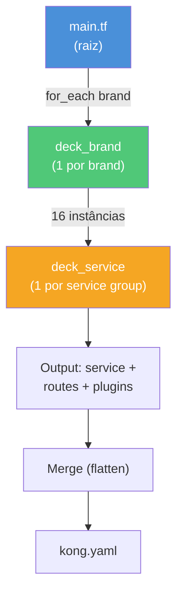
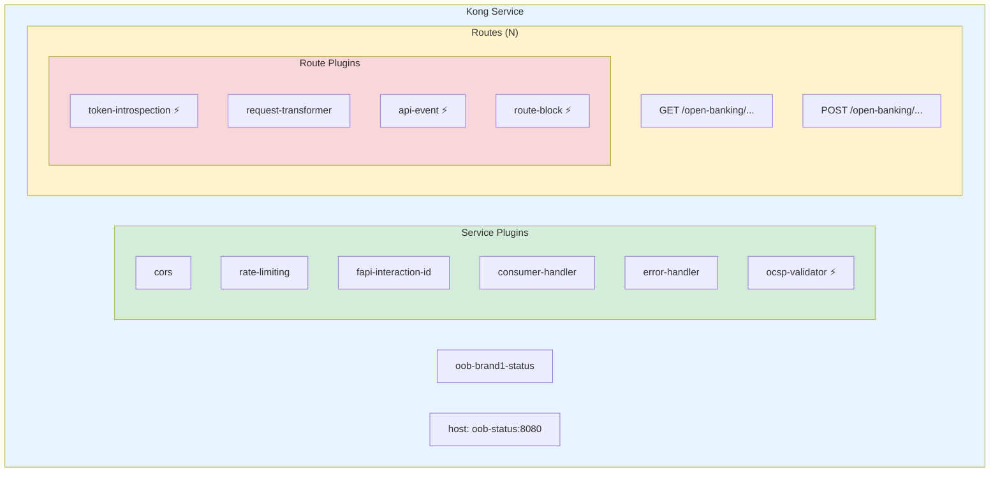

# Módulos Terraform — Kong Deck

Dois módulos que transformam variáveis de entrada em configuração declarativa do Kong.

## Arquitetura dos Módulos



## deck_brand

Orquestra os serviços de um brand/tenant. Para cada brand, instancia **16 sub-módulos** `deck_service`:

```mermaid
graph LR
    subgraph brand["deck_brand (1 brand)"]
        direction TB
        S1["status"]
        S2["status_maintenance"]
        S3["consent_payment"]
        S4["consent_data_sharing_v2"]
        S5["consent_data_sharing_v3"]
        S6["consent_credit_portability"]
        S7["consent_oob"]
        S8["consent_as ⚡"]
        S9["financial_data"]
        S10["payment"]
        S11["payment_oob"]
        S12["payment_as ⚡"]
        S13["open_data"]
        S14["auth_server_fapi"]
        S15["auth_server_fapi_mtls"]
        S16["auth_server_non_fapi"]
    end

    brand --> OUT["~283 routes total"]
```



> ⚡ = Condicional (`expose_internal_apis = true`)

### Arquivos

| Arquivo | Função |
|---------|--------|
| `main.tf` | Instancia 16 sub-módulos com variáveis por serviço |
| `routes_defaults.tf` | 283 definições de rotas padrão (Open Banking Brasil) |
| `variables.tf` | Variáveis do brand (hosts, portas, FQDNs, features) |

### Uso

```hcl
module "brand_services" {
  source   = "./modules/deck_brand"
  for_each = local.brands_map

  brand            = each.value
  component_prefix = var.component_prefix
  cors_origins     = var.cors_origins
  # ... demais variáveis
}
```

## deck_service

Módulo core que gera **1 service Kong** completo com routes e plugins no formato decK.

### O que gera



> ⚡ = Plugin condicional (ativado por variável)

### Plugins por Escopo

**Service-level** (sempre presentes):
- `cors` — Cross-Origin Resource Sharing
- `rate-limiting` — Limitação por IP
- `oob-fapi-interaction-id` — Header FAPI
- `oob-kong-consumer-handler` — Consumer handler
- `oob-error-handler` — Padronização de erros

**Route-level** (condicionais):
- `oob-token-introspection` — Validação OAuth2
- `request-transformer` / `response-transformer` — Manipulação de headers
- `oob-api-event` — Eventos de API (PCM)
- `oob-route-block` — Bloqueio regulatório
- `oob-operational-limits` — Limites operacionais

### Arquivos

| Arquivo | Função |
|---------|--------|
| `main.tf` | Lógica de geração do service, routes e plugins |
| `variables.tf` | Configuração do service (host, port, routes, plugins) |
