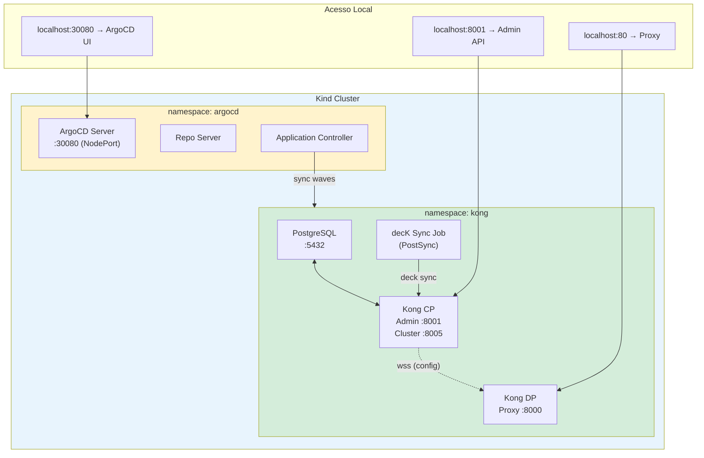
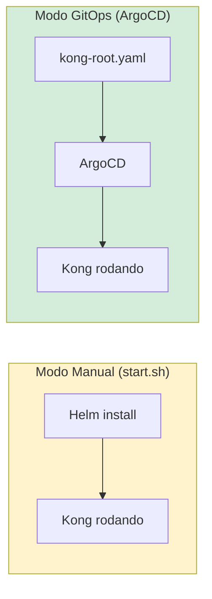

# PoC — Kong Gateway + ArgoCD no Kind

Ambiente completo de desenvolvimento local com Kong (modo híbrido) + ArgoCD GitOps.

## Arquitetura do Cluster



## Sync Waves (Ordem de Deploy)

```mermaid
gantt
    title ArgoCD Sync Waves
    dateFormat X
    axisFormat %s

    section Wave 0
    PostgreSQL           :done, 0, 1

    section Wave 1
    Kong Control Plane   :done, 1, 2

    section Wave 2
    Kong Data Plane      :done, 2, 3

    section Wave 3
    decK Sync Job        :done, 3, 4
```



| Wave | Componente | Dependência |
|------|-----------|-------------|
| 0 | PostgreSQL | Nenhuma |
| 1 | Kong CP | PostgreSQL (banco de config) |
| 2 | Kong DP | Kong CP (recebe config via wss) |
| 3 | decK Sync | Kong CP Admin API (aplica config) |

## Estrutura

```
poc/kong/
├── kind-config.yaml          # Config do cluster Kind (port mappings)
├── kong-helm/                 # Setup manual via Helm (start.sh)
│   ├── start.sh              # Gerenciador: install/uninstall/status
│   ├── values-argocd.yaml    # ArgoCD Helm values
│   ├── values-cp.yaml        # Kong CP Helm values
│   ├── values-dp.yaml        # Kong DP Helm values
│   ├── values-pg.yaml        # PostgreSQL Helm values
│   └── certs/                # Certificados TLS (gitignored)
└── kong-gitops/               # Manifests gerenciados pelo ArgoCD
    ├── applications/          # App-of-Apps pattern
    │   ├── kong-root.yaml    # Application raiz
    │   ├── postgres.yaml     # PostgreSQL (wave 0)
    │   ├── kong-cp.yaml      # Kong CP (wave 1)
    │   ├── kong-dp.yaml      # Kong DP (wave 2)
    │   └── kong-deck.yaml    # decK sync (wave 3)
    └── environments/hml/      # Values por ambiente
        ├── global-values.yaml
        ├── kong-cp-values.yaml
        ├── kong-dp-values.yaml
        ├── postgres-values.yaml
        └── deck/              # Kustomize + sync Job
            ├── kustomization.yaml
            ├── kong.yaml.gz
            └── sync-job.yaml
```

## Quick Start

### 1. Criar cluster Kind

```bash
kind create cluster --config kind-config.yaml
```

### 2. Setup manual (Helm)

```bash
cd kong-helm
./start.sh install     # Instala tudo (Kong + ArgoCD)
./start.sh status      # Verifica pods e credenciais
```

### 3. Setup via ArgoCD (GitOps)

```bash
# 1. Instala ArgoCD
./start.sh install-argocd

# 2. Aplica o App-of-Apps root
kubectl apply -f kong-gitops/applications/kong-root.yaml

# 3. ArgoCD gerencia todo o resto automaticamente
```

### 4. Acessar

| Serviço | URL |
|---------|-----|
| Kong Proxy | http://localhost:80 |
| Kong Admin | http://localhost:8001 |
| ArgoCD UI | http://localhost:30080 |

## Dois Modos de Uso



- **Manual**: Rápido para testes. `start.sh install` sobe tudo via Helm direto.
- **GitOps**: Produção. ArgoCD gerencia, sincroniza e faz rollback automaticamente.
