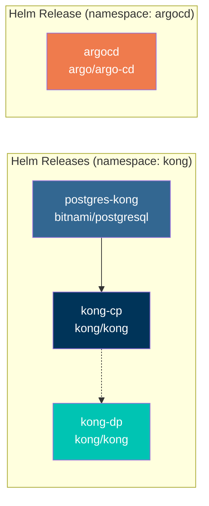
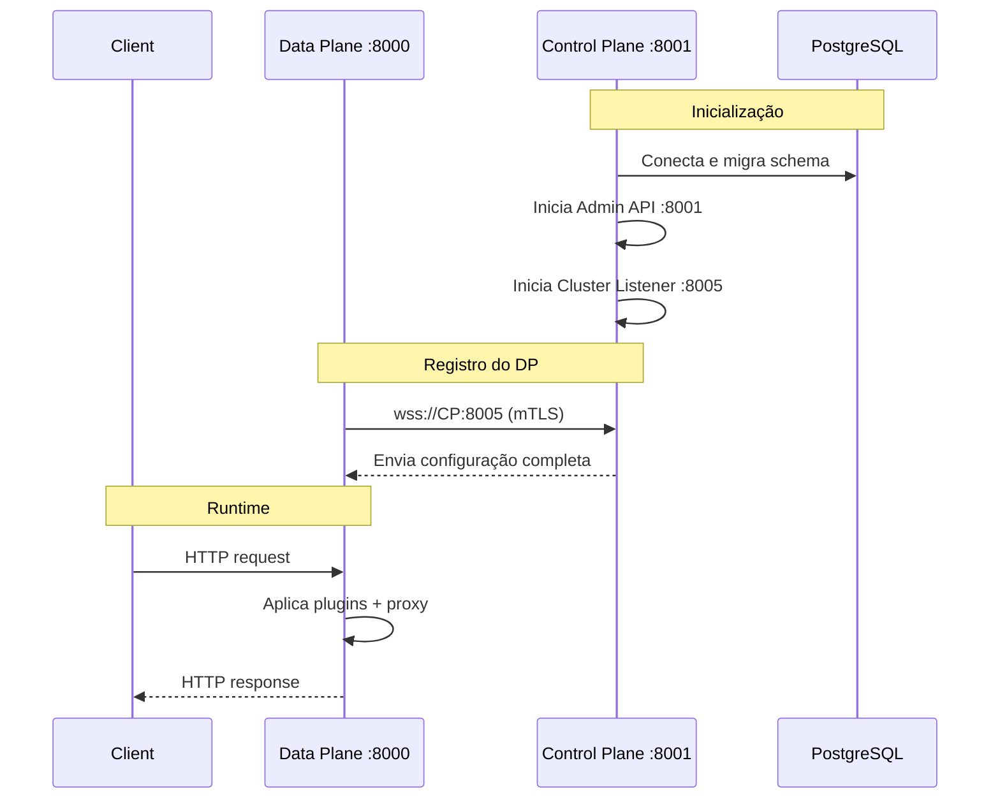

# Kong Helm — Setup Manual para Kind

Scripts e values para instalar Kong (modo híbrido) + ArgoCD via Helm no Kind.

## Componentes



## Uso

```bash
# Instalar tudo (importa imagem ECR + PostgreSQL + Kong CP/DP + ArgoCD)
./start.sh install

# Apenas Kong
./start.sh install-kong

# Apenas ArgoCD
./start.sh install-argocd

# Status (pods + credenciais)
./start.sh status

# Remover tudo
./start.sh uninstall
```

## Arquivos

| Arquivo | Chart | Descrição |
|---------|-------|-----------|
| `values-pg.yaml` | `bitnami/postgresql` | PostgreSQL para o Kong CP |
| `values-cp.yaml` | `kong/kong` | Kong Control Plane (Admin API + cluster) |
| `values-dp.yaml` | `kong/kong` | Kong Data Plane (proxy) |
| `values-argocd.yaml` | `argo/argo-cd` | ArgoCD com probes otimizadas para Kind |
| `start.sh` | — | Script gerenciador (install/uninstall/status) |
| `certs/` | — | Certificados TLS para cluster CP↔DP (gerados automaticamente) |

## Kong Modo Híbrido



## Troubleshooting

### Imagem ECR não importa

```bash
# Verificar login AWS SSO
aws sts get-caller-identity --profile opus-labs

# Reimportar manualmente
docker pull <ECR_IMAGE>
docker save <ECR_IMAGE> | docker exec -i kind-control-plane ctr -n k8s.io images import -
```

### Kong CP não conecta ao PostgreSQL

```bash
# Verificar service name
kubectl get svc -n kong | grep postgres
# O Helm release "postgres-kong" gera service "postgres-kong-postgresql"
```

### ArgoCD repo-server em CrashLoopBackOff

Probes muito agressivas. As probes em `values-argocd.yaml` já estão ajustadas para Kind. Se persistir:

```bash
kubectl -n argocd logs deploy/argocd-repo-server --tail=50
# Se "context canceled" → aumentar timeoutSeconds nas probes
```
