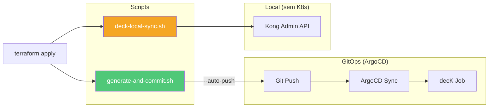
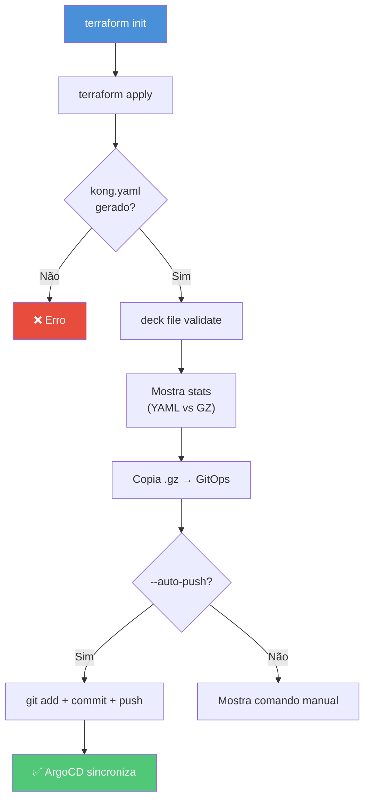
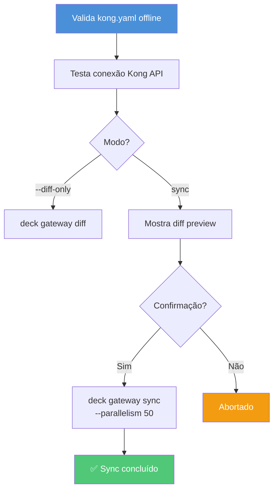

# Scripts de Automação — Kong Deck

Scripts para gerar, validar e aplicar a configuração do Kong.

## Visão Geral



## generate-and-commit.sh

Pipeline completo: Terraform → Validação → GitOps → ArgoCD.

### Uso

```bash
# Gerar kong.yaml apenas
./scripts/generate-and-commit.sh

# Gerar + commit + push (dispara ArgoCD)
./scripts/generate-and-commit.sh --auto-push

# Dry-run (apenas terraform plan)
./scripts/generate-and-commit.sh --dry-run
```

### Fluxo



## deck-local-sync.sh

Aplica `kong.yaml` diretamente na Admin API via decK — **sem Kubernetes**.

### Uso

```bash
# Sync interativo (mostra diff e pede confirmação)
KONG_ADMIN_URL=http://localhost:8001 ./scripts/deck-local-sync.sh

# Apenas mostra diff
./scripts/deck-local-sync.sh --diff-only

# Sync sem confirmação (CI/CD)
./scripts/deck-local-sync.sh --yes
```

### Fluxo



### Variáveis de Ambiente

| Variável | Default | Descrição |
|---|---|---|
| `KONG_ADMIN_URL` | `http://localhost:8001` | URL da Kong Admin API |

## Fluxo GitOps Completo

```
terraform apply → kong.yaml.gz → git push → ArgoCD → Kustomize ConfigMap → PostSync Job → deck gateway sync
```
